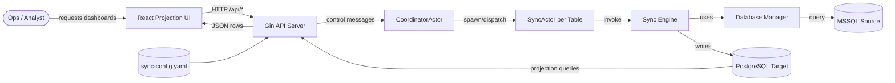
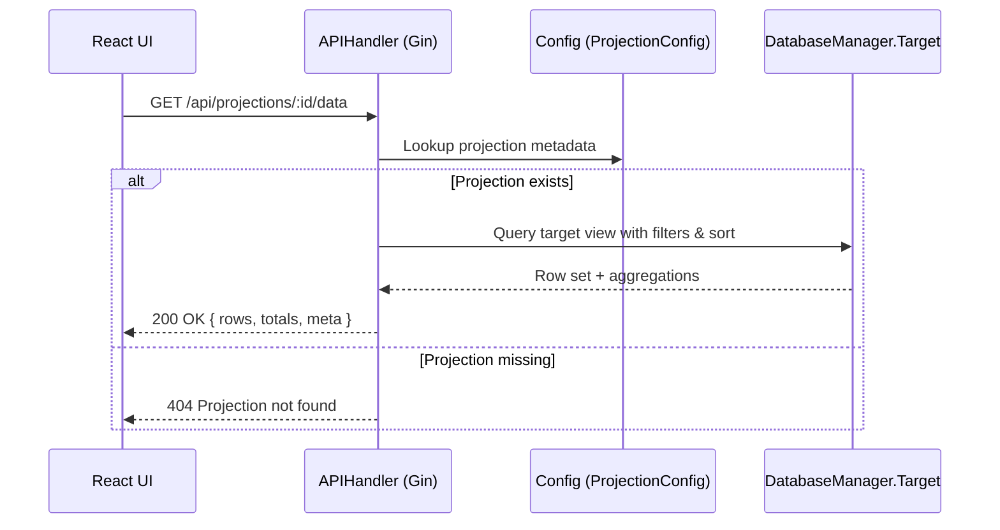
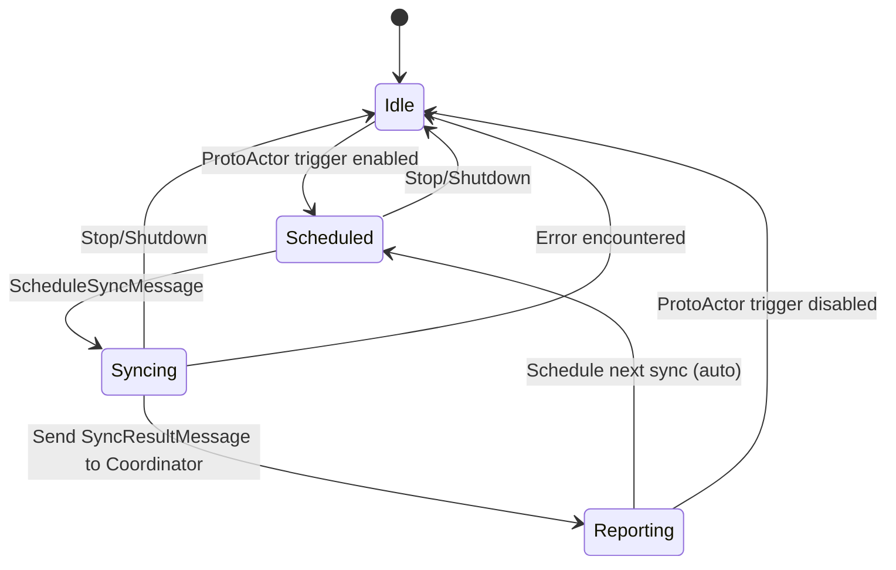

# ProjectionServer Diagrams

This document captures the core ProjectionServer workflows and runtimes inferred from the Go service that synchronizes Microsoft SQL Server data into PostgreSQL and exposes projection-ready views over a Gin HTTP API.

## Data Flow Overview

## Projection Data Request Sequence

## Sync Actor Lifecycle

These diagrams emphasize how projection requests traverse the service, how asynchronous synchronization feeds the projection data sets, and how configuration drives each component.
